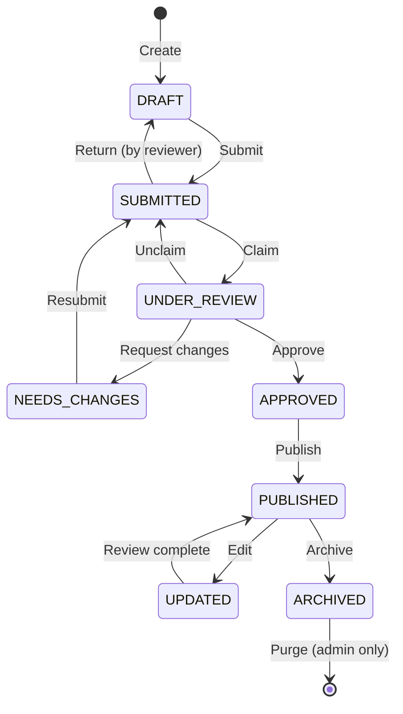

# Workflow State Machine

**Document ID:** SPEC-WFSM-001  
**Version:** 1.0  
**Status:** Approved  
**Last Updated:** 2026-07-06

---

## 1. Purpose

Define the formal state machine that governs record transitions throughout the tProkash publishing ecosystem. This specification ensures consistent, auditable, and predictable movement of records between lifecycle stages.

## 2. Scope

All entity records in the tProkash system, including publisher records, book records, author records, and any future entity types. This specification applies to every state transition regardless of the triggering user role or automation layer.

## 3. State Definitions

| State | Description |
|---|---|
| DRAFT | Record created but not yet submitted for review. Only the creator and administrators can view it. |
| SUBMITTED | Record submitted to the review queue. Visible to all Reviewers, Editors, and Administrators. |
| UNDER_REVIEW | A Reviewer has claimed the record and is actively evaluating it against quality criteria. |
| NEEDS_CHANGES | Reviewer has requested modifications. Only the creator or an Editor may update the record. |
| APPROVED | Reviewer has approved the record. Awaiting publication action by an Editor. |
| PUBLISHED | Editor has published the record. Publicly visible in search and datasets. |
| UPDATED | Published record has been modified. A confirmation step finalizes the change. |
| ARCHIVED | Record is no longer active but retained for historical reference in the database. |

## 4. State Transition Diagram

## 5. State Transition Rules

| From | To | Trigger | Who | Conditions | Side Effects |
|---|---|---|---|---|---|
| DRAFT | SUBMITTED | Submit | Creator, Verified Contributor, Reviewer, Editor, Admin | All required fields populated, at least one source attached, no validation errors | Notification sent to review queue |
| SUBMITTED | UNDER_REVIEW | Claim | Reviewer, Editor, Admin | Record not claimed by another reviewer | Reviewer assigned, SLA timer starts |
| UNDER_REVIEW | NEEDS_CHANGES | Request changes | Reviewer, Editor, Admin | Reason provided, specific fields identified | Notification to creator, response timer starts |
| UNDER_REVIEW | APPROVED | Approve | Reviewer, Editor, Admin | All review checklist items passed, source material verified | Notification sent to creator and editor |
| APPROVED | PUBLISHED | Publish | Editor, Admin | Record approved, no pending issues | Record becomes public, dataset count updated, search index refreshed |
| PUBLISHED | UPDATED | Edit | Editor, Admin | Change reason provided, source attached for major changes | Change history recorded, re-verification triggered if confidence < 70 |
| UPDATED | PUBLISHED | Confirm | Editor, Admin | Review complete if re-verification was triggered | Change history finalized, version number incremented |
| PUBLISHED | ARCHIVED | Archive | Editor, Admin | Reason provided, no active contracts or references | Record removed from active datasets, preserved in database |
| NEEDS_CHANGES | SUBMITTED | Resubmit | Creator | All requested changes addressed, no validation errors | Returns to queue for re-review, SLA timer resets |
| SUBMITTED | DRAFT | Return | Reviewer, Editor, Admin | Reason provided | Record returned to creator's drafts, queue position vacated |
| UNDER_REVIEW | SUBMITTED | Unclaim | Reviewer, Editor, Admin | Reviewer unable to complete review | Record back in queue, available for other reviewers |

## 6. SLA Timeouts and Escalation

Each transition that enters a timed state triggers a deadline. Failure to act within the defined window escalates the record to the next authority level.

| State | SLA | Escalation Action |
|---|---|---|
| SUBMITTED | 24 hours | Notify review queue manager, auto-assign to next available reviewer |
| UNDER_REVIEW | 48 hours (simple), 5 days (complex) | Notify reviewer, escalate to Editor if no response within 24 hours of deadline |
| NEEDS_CHANGES | 7 days | Notify creator daily after day 5, auto-return to SUBMITTED with partial changes allowed after 7 days |
| APPROVED | 24 hours | Notify Editor, auto-publish eligible if confidence >= 90 |

## 7. Error States and Recovery

| Error Condition | Behavior | Recovery |
|---|---|---|
| Validation failure on submit | Transition blocked, errors returned | Fix validation errors, retry |
| Concurrent claim conflict | Second claimer notified | Await first reviewer or unclaim timeout |
| System failure mid-transition | Record remains in source state | Manual recovery by Administrator |
| Orphaned record (no reviewer) | Stays in SUBMITTED | SLA escalation assigns reviewer |
| Confidence score drop after edit | Triggers re-verification | Must complete review before UPDATED->PUBLISHED |

## 8. Examples

**Example 1: Standard Community Submission**
DRAFT (create) → SUBMITTED (submit) → UNDER_REVIEW (claimed) → APPROVED (approved) → PUBLISHED (published)

**Example 2: Revision Request Cycle**
DRAFT → SUBMITTED → UNDER_REVIEW → NEEDS_CHANGES (reviewer requests corrections) → SUBMITTED (resubmitted) → UNDER_REVIEW → APPROVED → PUBLISHED

**Example 3: Published Record Update**
PUBLISHED → UPDATED (editor edits metadata) → PUBLISHED (changes confirmed)

**Example 4: Full Lifecycle to Archive**
DRAFT → SUBMITTED → UNDER_REVIEW → APPROVED → PUBLISHED → UPDATED → PUBLISHED → ARCHIVED → [*] (purge after 3 years)

## 9. Future Considerations

- **Automated transitions** based on machine learning confidence scores for low-risk records (confidence >= 95)
- **Parallel review workflows** enabling multiple reviewers to evaluate different aspects of a single record simultaneously
- **Conditional branching** where the transition path depends on record category or risk classification
- **Scheduled transitions** for time-based publishing and archiving
- **Chained approval workflows** requiring sequential approvals from multiple reviewers before publication
